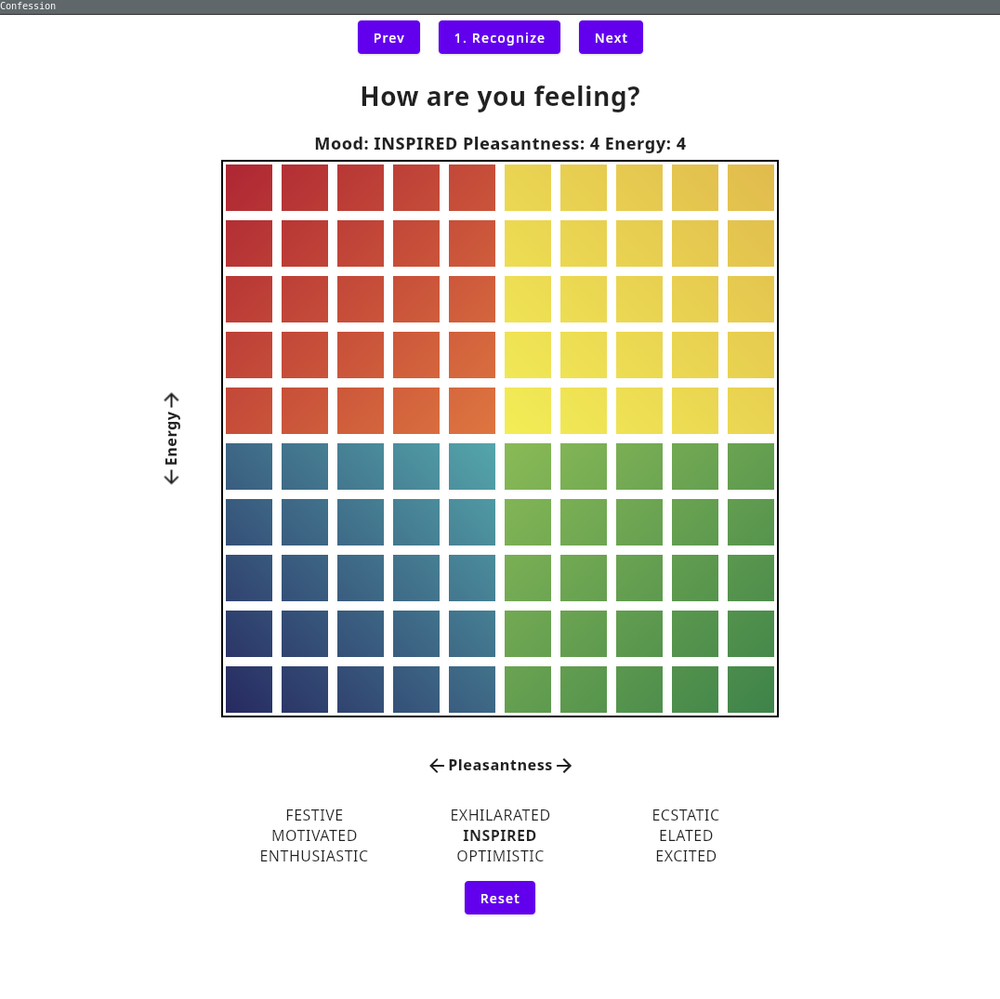
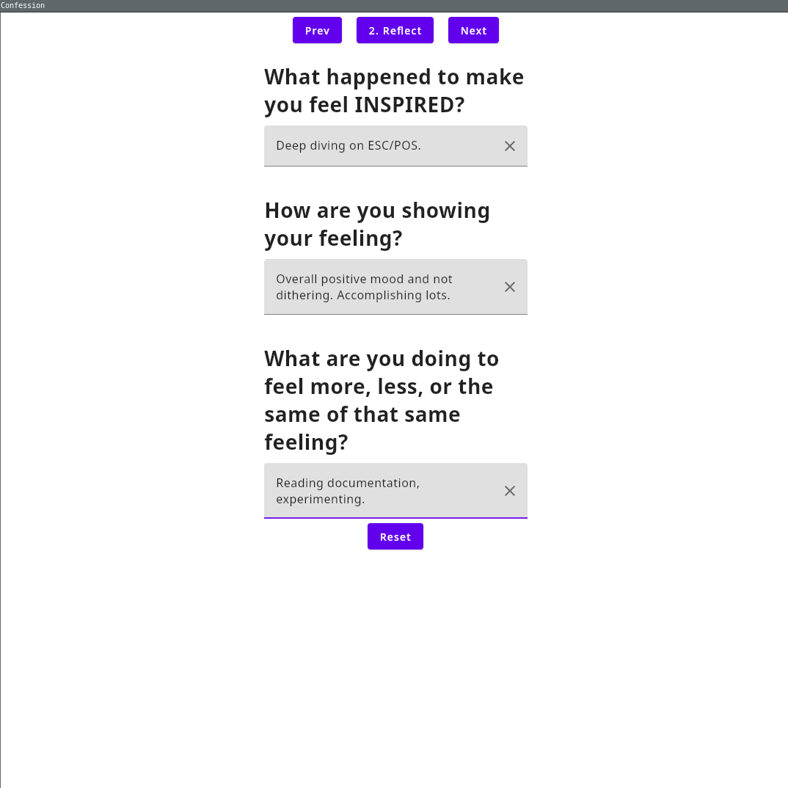
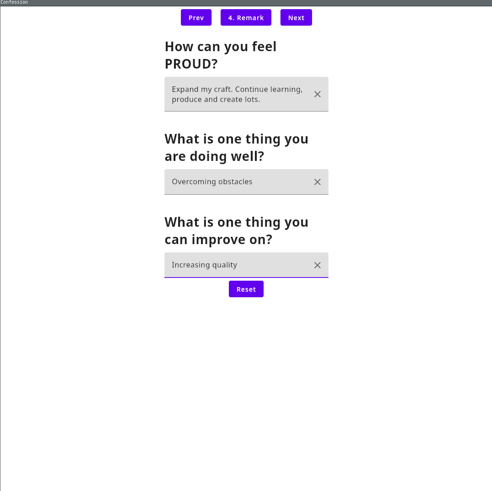
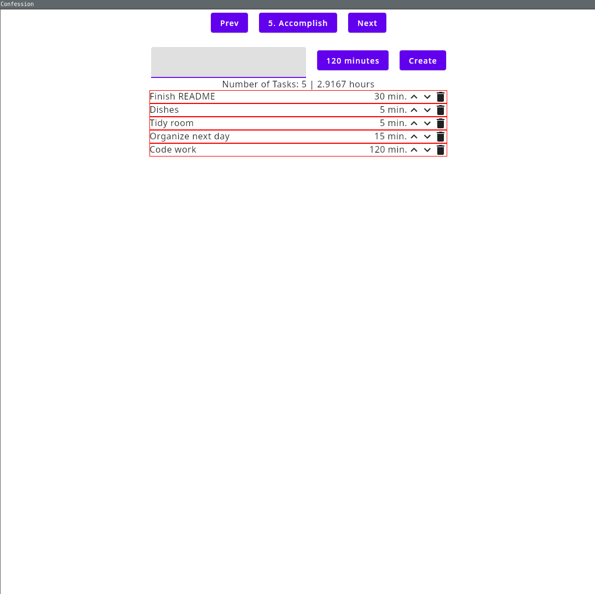
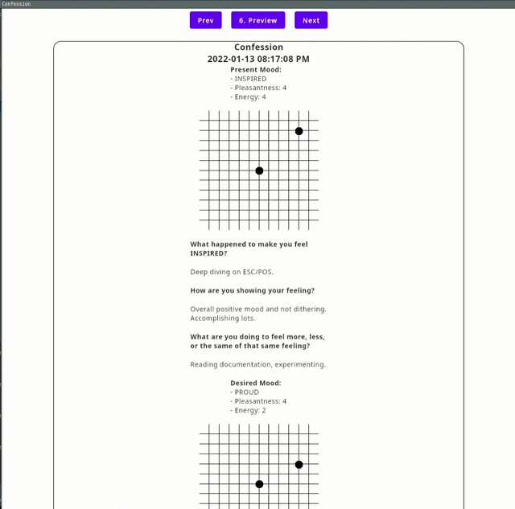
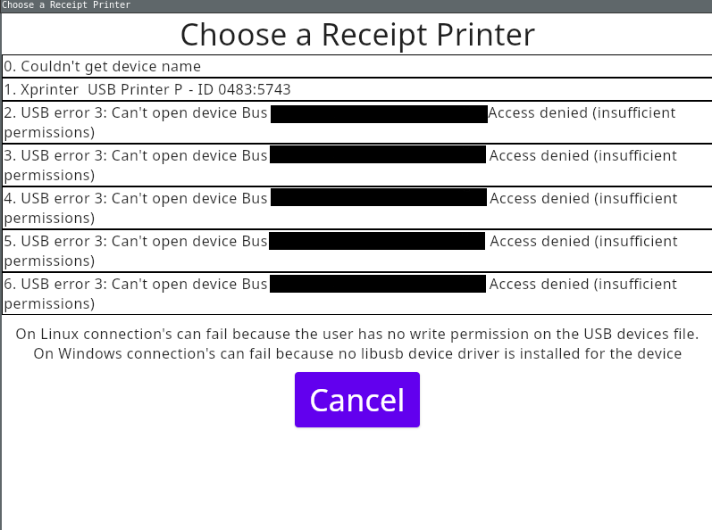
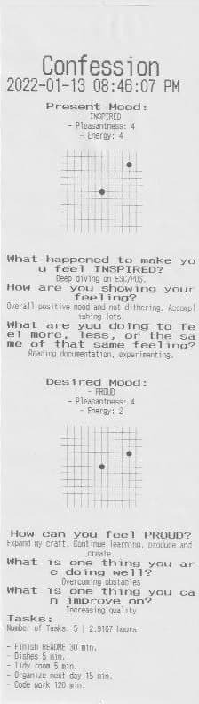

# Confession

Confess to how you feel and what must get done.

## Getting Started


### Prerequisites

- Kotlin
- JDK 11+
- ESC-POS Printer (optional)
- Windows, Linux, MacOS

### Installing

```
git clone https://github.com/maxgdn/confession.git
```

Sync gradle and run the MainKt file.

## Demo

### Recognize



### Reflect



### Become


### Remark



### Accomplish



### Preview



### Export


### PDF Export

[Sample](media/confession_2022_01_13_08_42_PM.pdf)

### Receipt Printer Export





###Resources

- [ESC/POS Specification](https://reference.epson-biz.com/modules/ref_escpos/index.php?content_id=72)
- [Permission to Feel: Unlocking the Power of Emotions to Help Our Kids, Ourselves, and Our Society Thrive](https://www.marcbrackett.com/about/book-permission-to-feel/)

